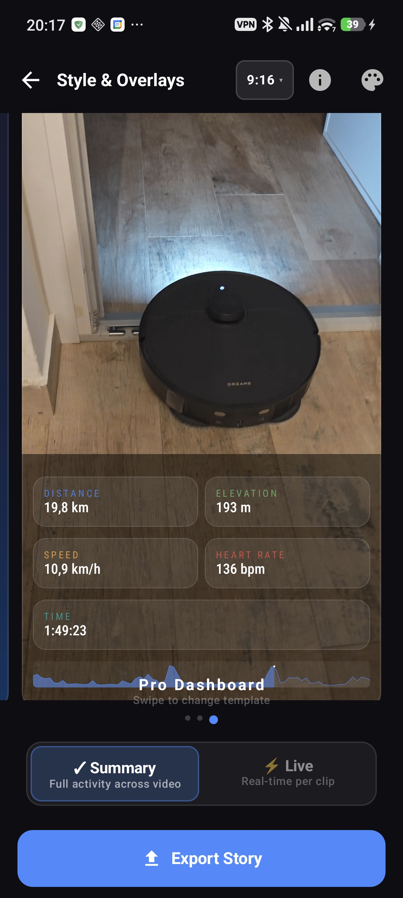
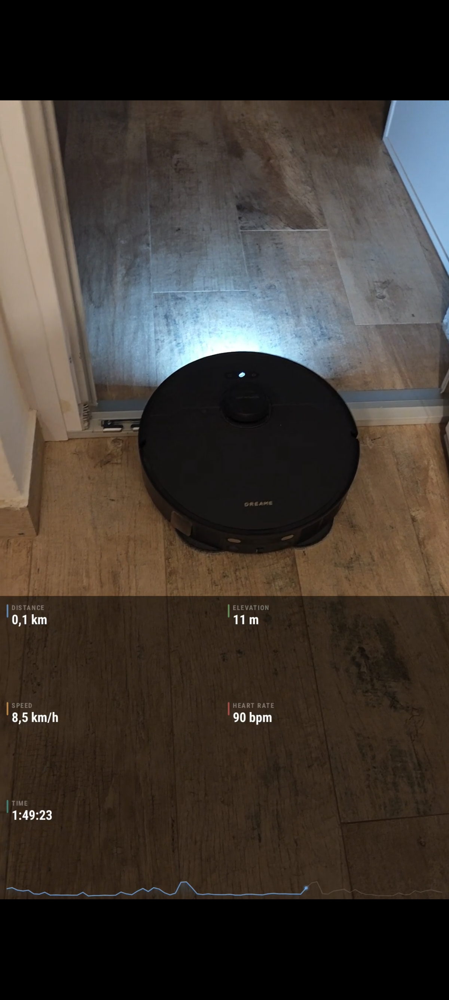

# GPX Video Producer

An Android app for endurance athletes to create professional social media videos with real-time telemetry overlays from GPX/TCX activity data. Combine your ride, run, or hike footage with live speed, elevation, heart rate, and route visualizations — all synced to your GPS track.

<p align="center">
  
  &nbsp;&nbsp;
  
</p>

---

## Features

### Video Assembly ("The Cut")
- **Multi-clip timeline** — import multiple video clips onto a single track with a CapCut-style center-fixed playhead
- **Trim & resize** — drag clip handles to trim from start or end; timeline auto-adjusts neighboring clips
- **Transitions** — crossfade, dissolve, slide, and wipe transitions between clips
- **Visual effects** — tap-to-apply color LUT effects per clip (8 presets)
- **Audio toggle** — mute/unmute individual clips
- **Undo / Redo** — full undo history for all timeline operations (global top bar)
- **Aspect ratio selector** — switch canvas format (9:16, 16:9, 4:5, 1:1) at any time; preview updates instantly

### Style & Telemetry ("The Magic")
- **SVG overlay templates** — designed in Figma, exported as SVG with per-template custom fonts
- **Predefined templates** — swipe between *Cinematic*, *Hero*, *Pro Dashboard*, *Pulp*, and more
- **Two sync modes:**
  - **Summary** — proportionally maps the entire GPX track across your video duration; works with any footage, even clips without timestamps
  - **Live** — real-time sync using GPS timestamps for exact telemetry at each frame; supports spatial alignment via an interactive elevation chart

### Overlay System
- **Static overlays** — full-route elevation profile, GPS route map, summary stats card
- **Dynamic overlays** — live altitude chart with moving marker, live map with trail, real-time single-metric readouts (speed, heart rate, cadence, power, temperature, grade)
- **Text labels** — custom text overlays with font and position control
- **Adaptive layout** — overlays automatically reposition when you change the aspect ratio

### Export
- **Media3 Transformer** pipeline — hardware-accelerated video composition
- **Codec support** — H.264, H.265, VP9
- **Resolution** — 720p, 1080p, 1440p, 4K
- **What you see is what you get** — exported video matches the preview exactly

### GPX / TCX Parsing
- Full GPX and TCX file parsing with telemetry extraction
- Supports: heart rate, cadence, power, temperature, speed, elevation
- Statistics: distance, elevation gain/loss, moving time, average/max metrics
- Haversine distance calculation, elevation smoothing, pause detection

---

## Architecture

The project follows a **multi-module clean architecture** with MVVM, Hilt dependency injection, and Jetpack Compose throughout.

```
gpx-video-producer/
├── app/                    # Application entry point, navigation graph, DI setup
├── core/
│   ├── model/              # Domain data classes (Project, GpxData, Overlay, Timeline)
│   ├── database/           # Room database (v3), entities, DAOs
│   ├── common/             # Shared utilities, DI modules, DataStore preferences
│   ├── overlay-renderer/   # SVG template loading, placeholder resolution, Canvas rendering
│   └── ui/                 # Compose theme, reusable UI components
├── feature/
│   ├── home/               # Project list, onboarding, settings
│   ├── project/            # Video assembly screen, style & overlay screen, editor VM
│   ├── timeline/           # Timeline state management (clips, transitions, adjustments)
│   ├── preview/            # ExoPlayer-based playback engine with position tracking
│   ├── export/             # Media3 Transformer export pipeline, overlay frame renderer
│   ├── gpx/                # GPX import, route visualization, altitude profile canvas
│   ├── overlays/           # Overlay catalog, renderers, GpxTimeSyncEngine
│   └── templates/          # Built-in & user-saved overlay templates
├── lib/
│   ├── gpx-parser/         # XML pull parser for GPX/TCX with statistics computation
│   ├── ffmpeg/             # FFmpeg command builder (legacy, transitioning to Media3)
│   └── media-utils/        # Video metadata probing, thumbnail generation
└── gradle/
    └── libs.versions.toml  # Version catalog
```

### Navigation Flow

```
Onboarding → Home (project list)
                ├── Create Project → Video Assembly ("The Cut")
                │                         │
                │                    Style & Telemetry ("The Magic")
                │                         │
                │                      Export
                └── Settings
```

### Key Architectural Decisions

| Decision | Rationale |
|----------|-----------|
| 2-screen flow instead of 4-step wizard | Progressive disclosure: instant gratification with Summary mode, advanced Live sync on demand |
| Center-fixed playhead (CapCut-style) | Timeline scrolls under a fixed center playhead — more intuitive clip navigation |
| Media3 Transformer over FFmpeg-kit | FFmpeg-kit was retired April 2025; Media3 provides native hardware-accelerated composition |
| Per-frame overlay rendering | Dynamic overlays are rendered as bitmap sequences synced to video timestamps via `GpxTimeSyncEngine` |
| Room database with JSON-serialized overlays | Flexible overlay schema without rigid relational mapping |

---

## Tech Stack

| Category | Technology | Version |
|----------|-----------|---------|
| Language | Kotlin | 2.0.21 |
| UI | Jetpack Compose (Material 3) | BOM 2025.02 |
| DI | Hilt | 2.53.1 |
| Persistence | Room | 2.7.0 |
| Video Playback | Media3 ExoPlayer | 1.5.1 |
| Video Export | Media3 Transformer | 1.5.1 |
| Overlay Templates | AndroidSVG + Figma | 1.4 |
| Image Loading | Coil 3 | 3.0.4 |
| Navigation | Navigation Compose | 2.8.5 |
| Serialization | kotlinx-serialization | 1.7.3 |
| Async | Kotlin Coroutines | 1.9.0 |
| Preferences | DataStore | 1.1.2 |
| Testing | JUnit 5 | 5.11.4 |
| Build | AGP / Gradle | 8.7.3 |
| Min SDK | Android 8.0 | API 26 |
| Target SDK | Android 15 | API 35 |

---

## Building

### Prerequisites

- **Android Studio** Ladybug (2024.2) or later
- **JDK 17**
- **Android SDK** with API 35 platform and build tools

### Build & Run

```bash
# Debug build
./gradlew assembleDebug

# Install on connected device / emulator
adb install -r app/build/outputs/apk/debug/app-debug.apk

# Launch
adb shell am start -n com.gpxvideo.app/.MainActivity
```

### Project Configuration

The project uses Gradle version catalog (`gradle/libs.versions.toml`) for centralized dependency management, with configuration caching and parallel builds enabled.

```properties
# gradle.properties
org.gradle.parallel=true
org.gradle.caching=true
org.gradle.configuration-cache=true
```

---

## Module Details

### `core/model`

Pure Kotlin JVM module defining the domain language:

- **`Project`** — project metadata, sport type (cycling, running, hiking, trail running, skiing, etc.), output settings, story mode
- **`GpxData`** — parsed GPS data: tracks, segments, points with full telemetry (lat, lon, elevation, HR, cadence, power, temperature, speed)
- **`Overlay`** — sealed class hierarchy for static overlays (altitude profile, map, stats) and dynamic overlays (live altitude, live map, live stat, text label)
- **`Timeline`** — tracks, clips, transitions (cut, fade, dissolve, slide, wipe), and per-clip adjustments (volume, speed, brightness, contrast, saturation, rotation, scale, opacity)
- **`OutputSettings`** — resolution, aspect ratio (16:9, 9:16, 1:1, 4:5), frame rate, export format (H.264/H.265/VP9)

### `core/database`

Room database (version 3) with 7 entities: `ProjectEntity`, `MediaItemEntity`, `GpxFileEntity`, `TimelineTrackEntity`, `TimelineClipEntity`, `OverlayEntity`, `TemplateEntity`. Each entity has a corresponding DAO with Flow-based reactive queries.

### `core/overlay-renderer`

SVG-based overlay template system:

- **`SvgTemplateLoader`** — discovers templates in `assets/templates/` subdirectories, loads SVG + meta.json, registers per-template custom fonts
- **`SvgPlaceholderResolver`** — parses SVG XML to extract text layer positions/styles and chart/map bounds from named elements
- **`SvgOverlayRenderer`** — composites SVG static visuals + Canvas text (fill + stroke outlined) + chart/map data → single Bitmap
- **`OverlayTemplateRenderer`** — unified facade used by both preview and export for pixel-perfect parity
- **`ChartRenderer`** — elevation chart with monotone cubic Hermite spline smoothing, gradient fill, glow dot
- **`RouteMapRenderer`** — route map with Catmull-Rom spline smoothing, direction chevrons, start/end markers

See [`docs/TEMPLATE_GUIDE.md`](docs/TEMPLATE_GUIDE.md) for the full template authoring guide.

### `feature/preview` — PreviewEngine

The playback engine wraps Media3 ExoPlayer with:

- **Clip sequencing** — concatenates trimmed clips with `ConcatenatingMediaSource2`
- **Position tracking** — polling-based position updates synced bidirectionally with the timeline scroll state
- **Feedback loop prevention** — `rememberUpdatedState` for snapshotFlow params, `isAutoScrolling` flag, and 300ms user-scroll grace period
- **STATE_ENDED handling** — re-prepares the player before seeking when in ended state; `lastSeekTimeNanos` grace period prevents state handlers from overriding explicit seeks

### `feature/overlays` — GpxTimeSyncEngine

The core synchronization engine that maps video playback position to GPX telemetry:

```
Video Time → SyncMode Logic → Interpolated GPX Point
                                  ├── latitude, longitude, elevation
                                  ├── speed, heart rate, cadence, power
                                  ├── grade, temperature
                                  └── elapsed distance, elapsed time, progress
```

Three sync modes:
1. **GPX_TIMESTAMP** — matches video Exif timestamps to GPX point timestamps
2. **CLIP_PROGRESS** — proportionally maps entire GPX track across video duration
3. **MANUAL_KEYFRAMES** — user-defined spatial alignment points

### `feature/export` — Export Pipeline

Four-phase export:

1. **PREPARING** — validate clips and overlays, create temp directory
2. **RENDERING_OVERLAYS** — generate per-frame overlay bitmaps (dynamic) or single bitmaps (static) using Android Canvas
3. **COMPOSING** — Media3 Transformer composites video + overlays + effects + transitions
4. **FINALIZING** — clean up temp files, save to device storage

### `lib/gpx-parser`

Standalone XML pull parser for GPX and TCX files:

- Namespace-aware parsing of tracks, segments, waypoints
- Telemetry extraction from Garmin extensions (`gpxtpx:hr`, `gpxtpx:cad`, `gpxtpx:power`, `gpxtpx:atemp`)
- Statistics: Haversine distance, elevation gain/loss with smoothing, moving time with pause detection (< 0.5 m/s for > 30s), average/max for all metrics
- Downsampling for performance on large files

---

## Data Flow

```
┌─────────────┐    ┌──────────────────┐    ┌───────────────────┐    ┌──────────┐
│ Import Video │───▶│  The Cut          │───▶│  The Magic         │───▶│  Export  │
│ Import GPX   │    │  (Assembly)       │    │  (Style/Overlays)  │    │          │
└─────────────┘    └──────────────────┘    └───────────────────┘    └──────────┘
                          │                         │                      │
                    ┌─────▼─────┐            ┌──────▼──────┐        ┌─────▼──────┐
                    │ Timeline  │            │ GpxTimeSync │        │ Media3     │
                    │ ViewModel │            │ Engine      │        │ Transformer│
                    └─────┬─────┘            └──────┬──────┘        └─────┬──────┘
                          │                         │                      │
                    ┌─────▼─────┐            ┌──────▼──────┐        ┌─────▼──────┐
                    │ Preview   │            │ Overlay     │        │ Overlay    │
                    │ Engine    │            │ Renderer    │        │ Frame      │
                    │ (ExoPlayer)│           │ (Canvas)    │        │ Renderer   │
                    └───────────┘            └─────────────┘        └────────────┘
```

---

## License

Private project — not licensed for redistribution.
